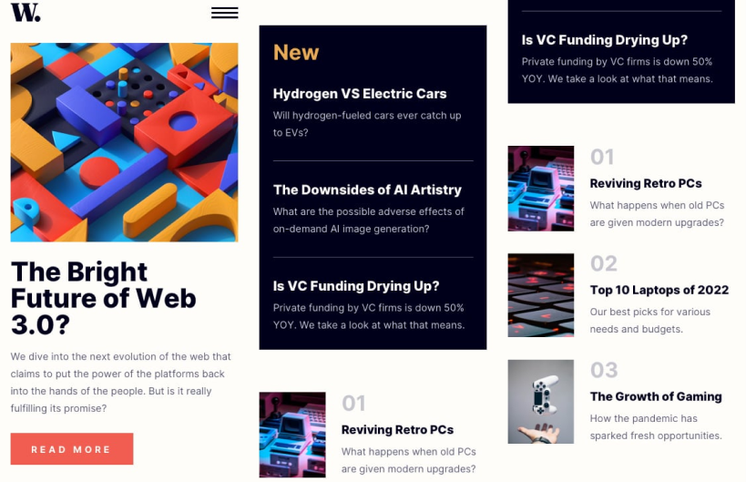

## News homepage
<br/>

####  Este Projeto faz parte dos desafios do front-end-mentor

<br/>

# Indice
<br/>

- <a href="#layout">Layout</a>
- <a href="#demonstração">Demonstração</a>
- <a href="#rodar">Como rodar o projeto</a>
- <a href="#tecnologias">Tecnologias utilizadas</a>


<br/>

## Layout





<br/>

## Demonstração


[Acesse o app](https://roomhomepagemp.netlify.app/)

<br/>

## Tecnologias Utilizadas


1. [React](https://react.dev/)
## Como rodar este projeto
<br/>

```bash
#clonar o repositório
$git clone linkrepo
#Acessar a pasta do projeto em seu terminal
$cd news-homepage
#Instalar dependencias
$npm install
#executar a aplicação
$npm start
```
<br/>